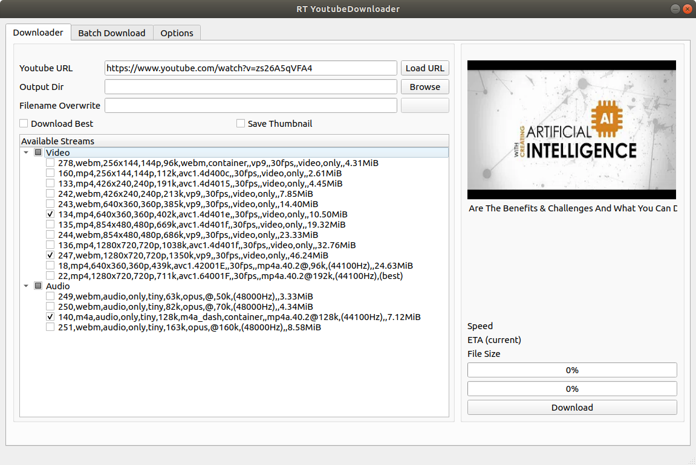

# Youtube Downloader
easy to use youtube downloader

  

### How to run

#### Requiements
- python3

#### Download and Run
~~~
git clone https://github.com/ramintoosi/YoutubeDownloader
cd YoutubeDownloader
sh install
pip install -r requirements.txt
python GUI.py
~~~
### How to use
Follow these steps:
1. Paste your url in "Youtube URL" text and click "Load URL"
2. The list of available streams (video and audio) would appear in "Available Streams"
3. Select desired streams(s)
4. Click Download

It's Done!

### Batch Download
Follow these steps
1. Write your URLs in a text file. Each line must contain a separate URL. A simple batch file is provided as an example ([batch](./batch))
2. Go to the "Batch Download" tab.
3. Click on "select" and choose your batch file (you can also paste its address directly in "Batch File" text)
4. Click Download
### Options
In each tab there exist some useful options.
#### Downloader
##### Output Dir
Click "Brows" to select the output dir or simply paste it in the "Output Dir" text. The default is the root of project.
##### Filename Overwrite
In a case you want to change the downloaded file name.
##### Download best
Disables the available streams and downloads the best quality. Please note that the best quality always has audio and may be different from the best available video stream only. You can also see the best quality properties in the available streams list (the last one in video streams).
##### Save Thumbnail
Also saves thumbnail image.
#### Batch Download
##### Output Dir
Click "Brows" to select the output dir or simply paste it in the "Output Dir" text. The default is the root of project.
##### Quality
Select to download the "Best" or the "Worst" quality of each URL.
##### Download to separate folders
Check to create a folder for each URL. With "Folder Name" you can determine the name of the created folder.
#### Options
##### Proxy
If you want to use a proxy write the address and port here as "proxy-type://address:port". For example, for default TOR, use "socks5://127.0.0.1:9050"